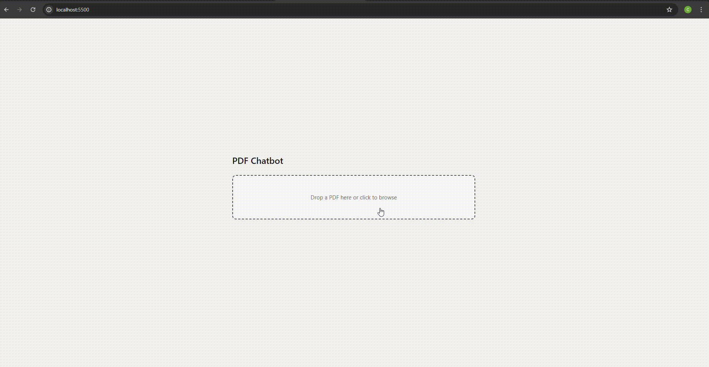

# 📄 PDF Chatbot

Upload any PDF and chat with it using semantic search + LLM-powered retrieval.

Built with **FastAPI**, **FAISS**, **Sentence Transformers**, and **Groq’s Llama 3.3 70B**.




---

## ✨ Features

- Upload and chat with any text-based PDF
- Semantic retrieval using embeddings + FAISS
- Answers grounded in retrieved source chunks
- Source excerpts shown for verification
- Local vector indexing for fast document search
- Simple FastAPI + vanilla JS architecture

---

## 🚀 How It Works

```text
1. PDF uploaded
   → text extracted page by page with PyMuPDF

2. Text chunked
   → split into 500-character overlapping chunks

3. Chunks embedded
   → converted into vectors using all-MiniLM-L6-v2

4. Stored in FAISS
   → local vector index built for similarity search

5. User asks a question
   → question embedded and top relevant chunks retrieved

6. Answer generated
   → retrieved context + question sent to Groq Llama 3.3
```

---

## 🛠 Tech Stack

| Layer | Technology |
|------|------------|
| Frontend | HTML, CSS, JavaScript |
| Backend | FastAPI, Python |
| LLM | Groq API (Llama-3.3-70b-versatile) |
| Embeddings | sentence-transformers |
| Vector Store | FAISS |
| PDF Parsing | PyMuPDF |
| Chunking | LangChain RecursiveCharacterTextSplitter |

---

## 📂 Project Structure

```bash
pdf-chatbot/
├── backend/
│   ├── main.py
│   ├── ingest.py
│   ├── retriever.py
│   ├── chat.py
│   └── routes/
│       ├── upload.py
│       └── ask.py
│
├── frontend/
│   ├── index.html
│   ├── style.css
│   └── app.js
│
├── data/
│   ├── uploads/
│   └── index/
│
├── assets/
│   └── demo.gif
│
├── .env
├── requirements.txt
└── README.md
```

---

## ⚙️ Setup

### 1 Clone the repository

```bash
git clone https://github.com/cerengulten/pdf-chatbot.git
cd pdf-chatbot
python -m venv venv
```

Activate environment:

```bash
source venv/bin/activate
```

Windows:

```bash
venv\Scripts\activate
```

---

### 2 Install dependencies

```bash
pip install -r requirements.txt
```

---

### 3 Add Groq API key

Create `.env`

```env
GROQ_API_KEY=your_key_here
```

Get one at:

https://console.groq.com

---

### 4 Run backend

```bash
uvicorn backend.main:app --reload
```

---

### 5 Run frontend

```bash
cd frontend
python -m http.server 5500
```

---

### 6 Open in browser

```bash
http://localhost:5500
```

---

## 💬 Usage

1. Upload a PDF  
2. Wait for indexing confirmation  
3. Ask questions in natural language  
4. View generated answers  
5. Expand **Show Sources** to inspect retrieved evidence

---

## 🧠 What I Learned

Building this helped me understand:

- Retrieval-Augmented Generation (RAG) end to end
- Embeddings and semantic similarity search
- Why chunk overlap matters for context preservation
- Prompt grounding with retrieved context
- Modular FastAPI backend design
- Semantic search vs keyword search

---

## ⚠️ Limitations

Currently:

- No OCR support for scanned/image PDFs
- One PDF indexed at a time
- Initial startup slower while embedding model downloads

---

## 🔮 Roadmap

- [ ] OCR support (Tesseract / Textract)
- [ ] Multi-document querying
- [ ] Streaming token responses
- [ ] Persistent FAISS storage
- [ ] User authentication
- [ ] Docker deployment

---

## 📄 License

MIT
